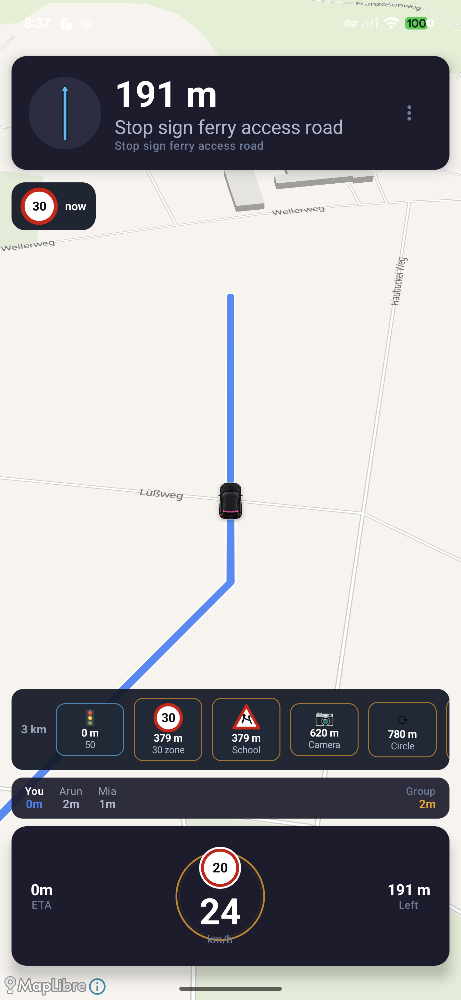

# Nav Plus

Nav Plus is an Android navigation app focused on a calmer driving experience: clear turn-by-turn guidance, route-only hazards, speed and limit visibility, live traffic overlays, lane guidance, speed camera awareness, and convoy support.

The v0 release is built around one core idea: while driving, the screen should show what matters next without forcing the driver to read dense text.



## Highlights

- Driving mode HUD with large next maneuver, route-shaped turn preview, speed, speed limit, ETA, remaining distance, and a compact 3 km hazard strip.
- Route choice flow with fastest, simple, scenic, safer, and low-stress route styles where routing data supports them.
- Speed camera and red-light camera warnings filtered to hazards on the active route, with unknown-limit cameras shown as generic camera warnings instead of invented limits.
- Persistent speed and speed-limit display during active navigation, with a breathing speed ring that changes character as speed approaches or exceeds the limit.
- Compact lane glow guidance for junctions and roundabouts, keeping the map visible and reducing large distracting panels.
- Country-aware traffic sign rendering for common German and European-style signs such as speed limit, school/children, traffic calming, stop, give way, and priority road.
- Traffic tiles and traffic-aware route badges using configured traffic data providers.
- Smart route preview timeline for cameras, signs, traffic, speed zones, roundabouts, junctions, tunnel, toll, border, and weather-style lookahead events.
- Convoy mode with group ETA, per-car ETA, rejoin state, route sync, stop voting, and local debug simulation for three cars.
- Android Auto integration groundwork for in-car navigation surfaces.
- Debug road scenario simulator that exercises speed zones, camera warnings, traffic signals, school zones, lane guidance, roundabouts, tunnel/bridge behavior, and convoy state changes.

## Driving Experience

The active navigation screen is intentionally structured:

1. Top: next maneuver, distance, route-shaped turn icon, and immediate lane guidance when needed.
2. Middle: map, route, traffic layer, vehicle pointer, and upcoming road context.
3. Bottom: one 3 km hazard strip, convoy bar when active, speedometer, ETA, and distance left.

This avoids duplicate warning chips and keeps upcoming hazards visible without covering the route. The HUD prioritizes glanceable symbols over long text where possible.

## Route Selection

After choosing a destination, Nav Plus can present multiple route choices instead of immediately starting the first route:

- Fastest: best ETA, traffic-aware where available.
- Simple: fewer turns, fewer lane changes, less tiny-road routing.
- Scenic: avoids motorways where reasonable and prefers more pleasant route character.
- Safer: avoids complex junctions and sharp-turn-heavy routes when possible.
- Low-stress: reduces aggressive merges, roundabouts, tram roads, and dense city-core routing where supported.

Selected routes render strongly on the map, while alternatives remain visible for comparison.

## Camera Intelligence

Nav Plus separates map camera visibility from driving warnings:

- During navigation, warnings are route-filtered and focused on the next 3 km.
- Known speed camera limits show the limit.
- Unknown-limit cameras say "camera ahead" and use the current road speed limit separately.
- Red-light and combined cameras use different visual treatment from ordinary fixed-speed cameras.
- Marker tap/debug detail can expose source, confidence, last updated, and known/unknown limit outside the active driving HUD.

Bundled camera data currently includes Germany-focused open/community and official merged sources, with support for extending European coverage through additional validated datasets.

## Traffic, Signs, and Road Context

The lookahead system can surface:

- Traffic signals and red-light cameras.
- Speed zones and speed limit changes.
- School and residential/traffic-calming areas.
- Stop, give way, and priority-road signs.
- Roundabouts and junction complexity.
- Tunnels, bridges, borders, tolls, roadworks, and other hazards when route data is available.

Traffic sign rendering uses a sign catalog model so country-specific variants can be added without changing the driving UI.

## Lane and Junction Guidance

Lane guidance is designed to stay compact:

- Recommended lanes glow in blue/green.
- Unrecommended lanes remain subtle gray.
- Arrows appear inside lane pills.
- Large diagrams are reserved for motorway forks, complex junctions, and multi-lane roundabouts.

Roundabout guidance can show the exit number and route-shaped direction, with room to map future OSM junction topology into more exact roundabout exit diagrams.

## Convoy Mode

Convoy support includes:

- Group creation and joining through a websocket relay.
- Live member location, speed, ETA, distance remaining, and online/offline state.
- Leader route sync.
- Group ETA based on the slowest arrival.
- Stop voting for fuel, food, supermarket, rest, and coffee.
- Rejoin state for deviated cars.
- Three-car debug convoy simulation in the driving scenario.

The driving HUD shows convoy state compactly. If a member deviates, the HUD marks them with a small rejoin indicator such as `Arun ↩` instead of adding a distracting warning panel.

## Android Auto

The project includes Android Auto navigation app metadata and car-app integration groundwork. The target experience is a decoupled setup where the car display keeps active navigation stable while the phone can be used for search, preview, and route planning without interrupting guidance.

## Data and Providers

Nav Plus is designed around free or low-cost data sources where possible:

- Map rendering through MapLibre-compatible surfaces.
- Routing through configured route engines.
- Traffic tiles through configured traffic providers.
- Speed camera assets from bundled validated files plus route-corridor fetchers.
- Traffic signal and road-context providers where public data is available.
- Weather/elevation support hooks for route-aware warnings.

Important: camera, traffic, sign, and speed-limit data can be incomplete or stale. Nav Plus should be treated as a driver assistance app, not a substitute for road signs, local laws, or driver judgment.

## Development

Requirements:

- Android Studio or Android SDK.
- JDK 17. On this machine the verified path was `/opt/homebrew/opt/openjdk@17`.
- A configured `local.properties` with Android SDK path.

Useful commands:

```bash
JAVA_HOME="/opt/homebrew/opt/openjdk@17" ./gradlew :app:assembleDebug
JAVA_HOME="/opt/homebrew/opt/openjdk@17" ./gradlew :core:group:testDebugUnitTest
```

Run the full driving scenario on a connected Android device:

```bash
adb install -r app/build/outputs/apk/debug/app-debug.apk
adb shell am start -S -a com.navplus.action.SIMULATE_DRIVE -n com.navplus.app/.MainActivity
```

The simulator exercises:

- Route pointer and snapping.
- Speed and speed-limit display.
- Route-only camera warnings.
- Red-light camera warnings.
- School and 30-zone signs.
- Roundabout and lane guidance.
- Traffic/tile rendering.
- Three-car convoy with a rejoin state.

## Release v0

v0 is the first integrated driving-experience release. It includes the core navigation HUD, route selection, safety lookahead, camera UX, traffic overlay, sign catalog, lane guidance, Android Auto groundwork, and three-car convoy simulation.

This is still an early release. The highest-priority next steps are broader European camera-data validation, more Android Auto screen testing, exact junction topology from OSM where available, and production-grade live traffic/signal provider hardening.
