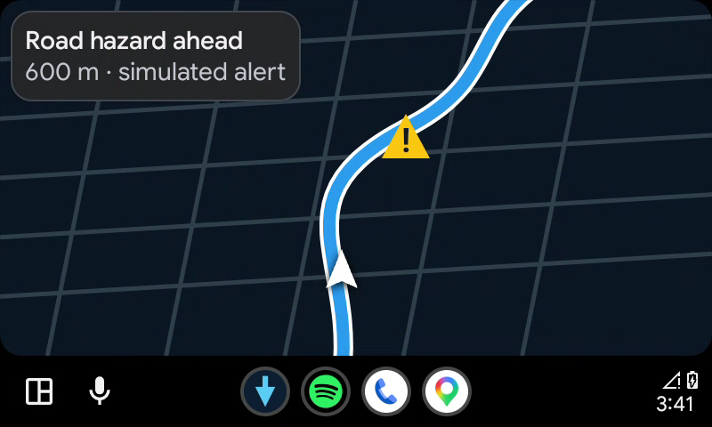

# RoadPulse Android Auto prototype

RoadPulse is a clean-room phone and Android Auto navigation-and-alert prototype. Google Places destination search and Google Navigation guidance are connected on both phone and Android Auto.

## What this build contains

- Android Auto navigation-template service (Car App API level 3)
- A live Google `NavigationViewForAuto` map with current-position following
- A visible Android Auto Start/Stop action for the destination selected on the phone
- A map-first standalone phone planner with live position, destination marker, pan/zoom,
  My Location and Destination controls, and Google destination autocomplete
- A redesigned phone planner that puts destination and Start first, keeps smart-stop controls
  together, collapses source diagnostics, and uses a clearly separated parked **Explore** mode
- Persistent destination handoff shared by the phone and Android Auto service
- Persistent three-state supermarket and fuel controls shared by phone and Android Auto. **Need
  now** selects the first suitable open stop ahead; **Best detour** searches the full remaining
  route and selects the smallest added driving distance. Both confirm opening at ETA and require
  the stop to remain open for at least 15 minutes after arrival
- In-app Google Navigation map, route calculation, voice guidance, and first-use terms flow
- Google Navigation's current-road speed-limit sign and live vehicle speedometer on the phone
- An Android-restricted Google API key loaded from ignored `local.properties`
- A policy guard that hides speed-camera warnings while driving in Germany
- Outside blocked/unknown driving jurisdictions, fixed-speed, average-speed, red-light, and
  rail-crossing cameras are matched to the active route and current map viewport. The guidance
  card shows the next camera type, mapped limit when available, and route distance. Germany and
  unresolved countries fail closed; the parked camera explorer remains available
- Persistent local hard stops at 1,000 Google search requests and 1,000 navigation destinations per UTC month
- A unified offline updater for Open-GATSO plus official French, Brussels, and Luxembourg feeds
- Original-source preservation, strict size/schema/count validation, atomic activation, and last-good fallback
- A phone-only stationary camera layer combining Open-GATSO, official feeds, and live OpenStreetMap enforcement data
- A separate road-context layer for mapped traffic signals, stop/give-way signs, speed limits,
  traffic restrictions, rule/zone start and end signs, pedestrian and railway crossings,
  traffic calming, school zones, tunnels, bridges, tolls, steep grades, dimension limits,
  and mapped surface hazards
- Visible-road OpenStreetMap speed-limit signs, including numeric, no-fixed-limit, walking,
  directional, per-lane, variable, conditional, and German implicit-rule metadata when mapped
- Speed cameras use a camera silhouette with a small speed badge, while regulatory speed-limit
  signs remain circular. Mapped maxspeed road geometry is coloured by speed band on phone and
  Android Auto, with a persistent legend in settings
- Road signs and infrastructure are shown during guidance only when tightly matched to the active
  route ahead: traffic lights, stop/give-way/priority signs, crossings, speed and road-rule signs,
  restrictions, traffic calming, schools, bridges, tunnels, tolls, and mapped surface hazards.
  Only route-matched features inside the current visible map are drawn; panning or zooming updates
  them automatically. Slope remains in its travelling-data panel rather than becoming a map marker
- A shared adaptive Road Ahead engine for phone and Android Auto. It ranks road controls, speed
  changes, permitted camera information, and meaningful terrain; shows at most two items; and
  suppresses secondary/low-priority details near an imminent maneuver
- Numeric and compass-direction matching for OSM signs and camera records, with route-match
  confidence, tighter cross-track confidence, and rejection of opposite-direction records
- Immediate intelligence refresh after route generation, deviation, alternative selection,
  waypoint progression, or any other Navigation SDK route change
- A compact RoadPulse trip footer with remaining distance, duration, and arrival time, replacing
  the duplicate Google ETA card beneath the custom guidance panel
- During guidance, the current route is matched to mapped speed-limit sections up to 15 km ahead;
  RoadPulse shows the distance to the next mapped change and estimates minutes from current GPS speed
- Live German Autobahn queues, warnings, roadworks, and closures with direction, delay,
  coloured geometry, and explicit start/end markers
- Autobahn webcams, lorry/car parking capacity and amenities, and EV charging locations with
  advertised maximum connector power
- Public highway restrooms from cached OpenStreetMap and Autobahn-facility data, with distinct
  free, paid, and fee-unknown WC markers plus mapped hours/accessibility details
- Route-ahead elevation and average uphill/downhill grade on phone and Android Auto, using a
  rounded 90-metre terrain profile with persistent offline cell caching. Terrain is presented
  only in the active-driving guidance panel and is deliberately not drawn as map signboards
- Official DWD weather-warning polygons plus the nearest road-weather station's 24-hour surface
  forecast, including dry/damp/snow/frost/freezing-wetness/black-ice condition
- Three-minute event caching with saved-data fallback; the last phone-map traffic snapshot is
  carried into Android Auto as a concise status and road-event overlay
- Offline-first caches for every new public feed, with bounded downloads and last-good fallback
- Phone and Android Auto markers/status for traffic events, road services, weather warnings,
  and road-surface risk; the projected screen remains intentionally glanceable
- A shared high-contrast symbol system on both maps: German-style stop/give-way/speed-limit
  signs, traffic lights, crossings, warning triangles, closures, parking, charging, webcams,
  road-weather symbols, and explicit event start/end badges instead of generic letter pins
- A measured directional-flow model for vehicles/hour, average speed, density, and estimated
  vehicles in a chosen road horizon; it refuses to calculate without a real sensor measurement
- Viewport-based camera loading, persistent offline OSM regions, two-hour refresh checks,
  conservative 30-metre semantic duplicate merging, complete source metadata, and wide-zoom grouping
- Automatic daily Open-GATSO refresh, two-hour OSM viewport freshness, offline fallback, and visible data time
- A conservative Android Auto connection lock that prevents opening the parked explorer during projection
- A ten-minute fictional camera-warning simulation for UI testing; it never uses a real camera location
- A tested speed-compliance advisor and simulated Android Auto speed-limit sign ready for live data
- A concise local privacy notice describing Google and Open-GATSO data use
- Unit tests for alert policy, camera/traffic/facility/weather parsing, road-sign classification,
  elevation/grade analysis, spatial lookup, quotas, speed compliance, and the directional-flow calculation

## Verified Android Auto result

The debug build was installed on a Pixel 6 Pro running Android 16 with Android Auto 17.2. Live Google autocomplete returned and stored a Berlin Hauptbahnhof test destination, and the Google Navigation SDK displayed its official first-use terms. The official Desktop Head Unit rendered a live Google map centered on the current position, the selected destination, and a driver-safe Start action.



## What it does not contain

- Code, assets, credentials, server access, or license bypasses from the patched Blitzer APK
- Apple Maps or Blitzer data (both lack a supported reusable camera feed)
- Organic Maps code or map binaries
- Background location or overlay permissions
- A guarantee that every physical road has complete or current speed-limit data. Google shows its
  current-route sign only where it considers the limit reliable; mapped roads without a usable
  OpenStreetMap limit remain unknown rather than receiving a guessed number.
- Guessed traffic-light colours or guessed car counts. Mapped signal positions are shown, but
  live red/amber/green phase requires an authority feed. Bavaria's one-minute detector data
  requires Mobilithek subscription/machine access before it can drive the flow metric.

## Build

Use JDK 17 and the installed Android SDK:

```sh
JAVA_HOME=/opt/homebrew/opt/openjdk@17/libexec/openjdk.jdk/Contents/Home \
GRADLE_USER_HOME=/tmp/roadpulse-gradle-home \
./gradlew lintDebug test assembleDebug
```

Put the restricted debug key in ignored `local.properties` as `MAPS_API_KEY=...`. The configured Cloud project has Maps SDK for Android, Places API (New), and Navigation SDK enabled. RoadPulse enforces local monthly hard stops of 1,000 search sessions and 1,000 requested navigation destinations. Cloud billing alerts are useful notifications but are not treated as a hard cap. Apple Maps does not provide an Android map/navigation SDK that can be embedded in this Android Auto app.

Camera data is refreshed automatically when due and can also be refreshed from the More dialog.
At local zoom levels, the stationary phone map supplements it with cached OpenStreetMap
enforcement data for the visible viewport. Real German enforcement locations are not
passed to Android Auto driving mode. See [THIRD_PARTY_DATA.md](THIRD_PARTY_DATA.md) for
licensing and attribution details and [PRIVACY.md](PRIVACY.md) for the current local-test
privacy notice.

The separate road layer queries mapped infrastructure for the visible local viewport and uses
nearby Autobahn references to request live events and facilities from the Autobahn GmbH API.
It also loads DWD road-weather forecasts and official warnings. It deliberately labels signal
phase as unavailable and vehicle counts as unavailable when no measurement feed is connected;
neither is inferred from map colour.

During active guidance, RoadPulse samples the next two kilometres of route geometry against
Open-Meteo's Copernicus DEM GLO-90 elevation service. It shows current terrain elevation and the
average uphill/downhill grade ahead on the phone, and appends the same compact estimate to the
Android Auto road line. Rounded terrain cells are retained for offline reuse and refreshed after
180 days. This is terrain elevation at roughly 90-metre resolution—not surveyed road height—so it
must not be used for bridge clearance, braking, towing, or other safety-critical decisions.
